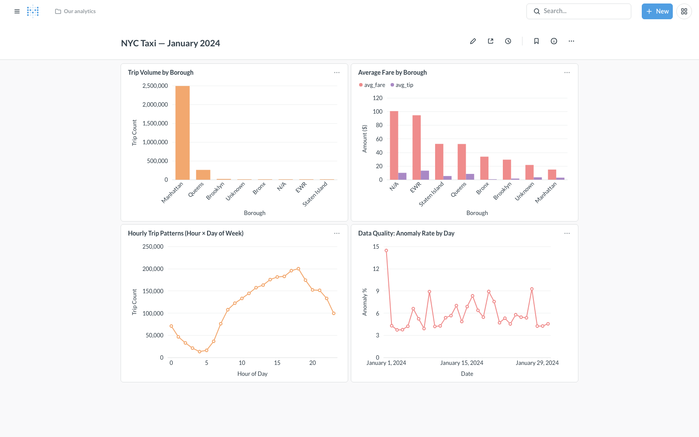

[](https://github.com/hemanthballa07/nyc-taxi-data-pipeline/actions/workflows/ci.yml)

# NYC Taxi Data Pipeline

An end-to-end data engineering portfolio project that ingests all 12 months of 2024 NYC Yellow Taxi trip records (41M rows), validates data quality with Great Expectations, transforms the data through a star schema using incremental dbt models, orchestrates everything with a 5-task Airflow DAG, and serves analytics through a Metabase dashboard — all running locally on Docker with CI via GitHub Actions.

---

## Architecture

```
┌─────────────────┐     ┌──────────────────────┐     ┌──────────────────────────────┐
│  NYC TLC Site   │────▶│  Python Ingestion    │────▶│  PostgreSQL 16               │
│  (Parquet ~3M   │     │  scripts/ingest.py   │     │                              │
│   rows/month)   │     │  - PyArrow + psycopg2│     │  raw.yellow_taxi_trips       │
└─────────────────┘     │  - COPY bulk load    │     │  raw.taxi_zone_lookup        │
                        │  - Delete+reload     │     │  raw.ingestion_log           │
                        └──────────────────────┘     └──────────────┬───────────────┘
                                                                    │
                                                    Great Expectations│ (10 expectations,
                                                      ge_validate   │  HTML report,
                                                                    │  soft fail)
                                                                    │
                                                            dbt run │ (incremental,
                                                                    │  delete+insert)
                                                                    ▼
                                                    ┌──────────────────────────────┐
                                                    │  staging                     │
                                                    │  stg_yellow_taxi_trips       │
                                                    │  (cast, clean, flag anomaly) │
                                                    └──────────────┬───────────────┘
                                                                   │
                                                           dbt run │
                                                                   ▼
                                                    ┌──────────────────────────────┐
                                                    │  marts (star schema)         │
                                                    │  dim_date · dim_location     │
                                                    │  dim_payment_type            │
                                                    │  dim_rate_code               │
                                                    │  fact_trips (36.5M rows)     │
                                                    │  fact_hourly_summary (~866K) │
                                                    └──────────────┬───────────────┘
                                                                   │
                                                                   ▼
                                                    ┌──────────────────────────────┐
                                                    │  Metabase Dashboard          │
                                                    │  Trip volume · Fares         │
                                                    │  Hourly patterns · DQ metrics│
                                                    └──────────────────────────────┘

          ┌──────────────────────────────────────────────────────────────────┐
          │  Apache Airflow 2.x — nyc_taxi_monthly DAG                      │
          │  ingest_trips → ge_validate → dbt_seed → dbt_run → dbt_test     │
          └──────────────────────────────────────────────────────────────────┘

          ┌──────────────────────────────────────────────────────────────────┐
          │  GitHub Actions CI — every push and PR                          │
          │  pytest tests/ · dbt parse                                      │
          └──────────────────────────────────────────────────────────────────┘
```

---

## Key Numbers

| Metric | Value |
|---|---|
| Raw rows loaded | 41,169,300 (all 12 months of 2024) |
| Clean trips in mart | 36,472,952 |
| Months of data | 12 |
| dbt tests | 35 (33 schema + 2 singular) |
| GE expectations per run | 10 |
| Airflow DAG tasks | 5 |
| Incremental run time (1 month) | ~3.5 min vs ~9.5 min full refresh |

---

## Tech Stack

| Layer | Tool | Version | Purpose |
|---|---|---|---|
| Ingestion | Python + PyArrow | 3.11 / 15.x | Download + bulk-load Parquet → Postgres |
| Warehouse | PostgreSQL | 16 | Star schema data warehouse |
| Data quality | Great Expectations | 0.18.22 | 10 expectations, HTML report per run |
| Transformation | dbt-core + dbt-postgres | 1.11 / 1.10 | Incremental ELT: staging → dims → facts |
| Orchestration | Apache Airflow | 2.9.3 | 5-task DAG, retries, soft-fail GE step |
| Dashboard | Metabase | 0.59 | Self-serve BI on mart tables |
| Containerization | Docker Compose | — | Single-command local environment |
| CI | GitHub Actions | — | pytest + dbt parse on every push/PR |

---

## Quick Start

### Prerequisites
- Docker Desktop (4GB+ RAM allocated)
- `make` (ships with Xcode Command Line Tools on Mac)

```bash
git clone https://github.com/hemanthballa07/nyc-taxi-data-pipeline.git
cd nyc-taxi-data-pipeline

# Start all services (Postgres, Airflow, Metabase) — ~2 min to initialize
make up

# Load one month of data and run the full pipeline
make ingest YEAR=2024 MONTH=1
make dbt-run
make dbt-test
```

### Service URLs

| Service | URL | Credentials |
|---|---|---|
| Airflow | http://localhost:8080 | airflow / airflow |
| Metabase | http://localhost:3000 | admin@nyctaxi.local / Admin1234! |
| PostgreSQL | localhost:5433 | nyctaxi / nyctaxi / nyctaxi |

### Run the full pipeline via Airflow DAG (recommended)

The DAG handles the complete flow for a given month — download, validate, transform, test:

```bash
# Trigger via CLI
docker compose exec airflow-webserver \
  airflow dags trigger nyc_taxi_monthly --conf '{"year": 2024, "month": 1}'

# Or: Airflow UI → DAGs → nyc_taxi_monthly → Trigger DAG w/ config
```

Tasks in order: `ingest_trips` → `ge_validate` → `dbt_seed` → `dbt_run` → `dbt_test`

### Load additional months

```bash
# Each month is idempotent — safe to re-run
make ingest YEAR=2024 MONTH=2
make dbt-run && make dbt-test
```

---

## Dashboard



Four charts built on the mart tables, using January 2024 data:

**Trip Volume by Borough** — Manhattan originates 89% of all trips (2.49M of 2.79M clean trips). Brooklyn and Queens together account for ~8%.

**Average Fare by Borough** — EWR and airport zones average $95–100 per trip vs. $13 in Manhattan. The airport premium is driven by flat-rate JFK fares and longer Newark routes.

**Hourly Trip Patterns** — Volume troughs at 5am and peaks at 6pm, a classic weekday commuter pattern. Weekend nights show a second peak around midnight.

**Data Quality Anomaly Rate** — Anomaly rate spikes to ~14% on January 1 (New Year's edge cases: zero-distance trips, extreme fares) and settles to 4–8% for the rest of the month.

---

## Data Model

```
             dim_date (366 rows)
                │
dim_location ──▶├── fact_trips (36.5M rows) ──▶ dim_payment_type (7 rows)
  (265 zones)   │
                └──────────────────────────▶ dim_rate_code (7 rows)

fact_hourly_summary (~866K rows) — pre-aggregated from fact_trips
```

| Schema | Table | Rows (full year) |
|---|---|---|
| raw | yellow_taxi_trips | 41,169,300 |
| staging | stg_yellow_taxi_trips | 41,169,300 |
| marts | fact_trips | 36,472,952 |
| marts | fact_hourly_summary | ~866,000 |
| marts | dim_date | 366 |
| marts | dim_location | 265 |

---

## Testing

```bash
# Python unit tests — no Docker required, fully mocked
make test

# dbt schema + singular tests — requires running Postgres
make dbt-test

# CI runs automatically on every push and PR
# pytest tests/ + dbt parse (syntax validation, no DB needed)
```

35 dbt tests cover uniqueness, not-null, accepted values, and two custom singular tests: no negative fares, no negative trip durations.

---

## Design Decisions

**Delete-and-reload idempotency**
`ingest.py` deletes all rows for the target month before loading. Re-running for the same month always produces the same row count. The DAG enforces `max_active_runs=1` to prevent concurrent runs racing on the delete step.

**Incremental dbt models**
`stg_yellow_taxi_trips` and `fact_trips` use dbt's `delete+insert` incremental strategy with a `trip_id` md5 surrogate key. When the DAG passes `--vars '{"year": ..., "month": ...}'`, the DELETE is scoped to the target month via `incremental_predicates` — avoiding a full 41M-row scan. Result: ~3.5 min per month vs ~9.5 min for a full refresh.

**Soft-fail Great Expectations**
The `ge_validate` task always exits 0 so the pipeline continues even when expectations fail. Failures are visible in the Airflow task logs and in a per-month HTML report saved to `docs/ge_report/`. This pattern matches production practice: a data quality failure is a signal, not always a reason to halt downstream consumers.

**Natural keys over surrogate keys in marts**
`fact_trips` joins to dims via natural IDs (`pickup_location_id`, `payment_type`, `rate_code_id`) rather than integer surrogate keys. For a PostgreSQL-backed Metabase dashboard with a static dimension set, the join performance is identical and the model is simpler to reason about.

---

## Data Source

[NYC TLC Yellow Taxi Trip Records](https://www.nyc.gov/site/tlc/about/tlc-trip-record-data.page) — published monthly in Parquet format. ~3M rows/month, ~50MB/file.
